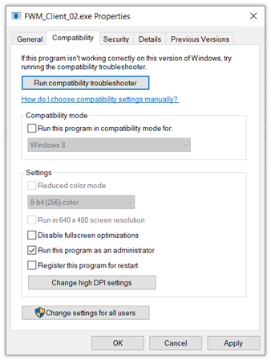
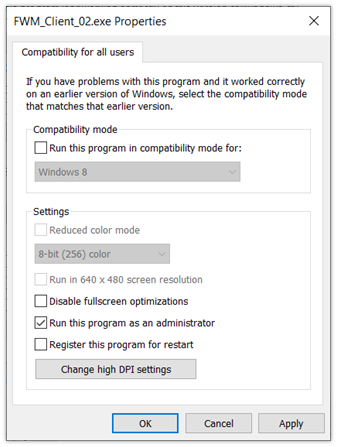
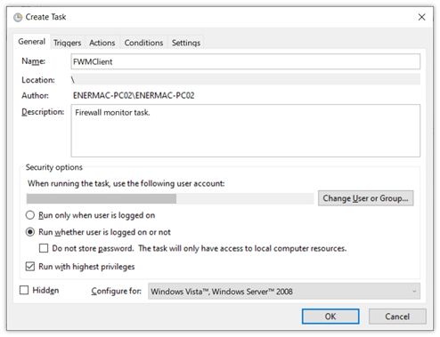
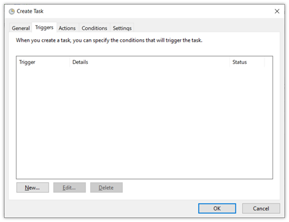
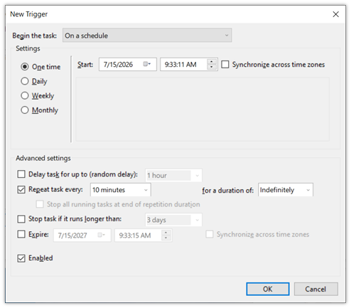
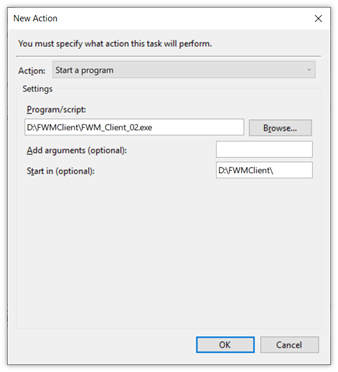
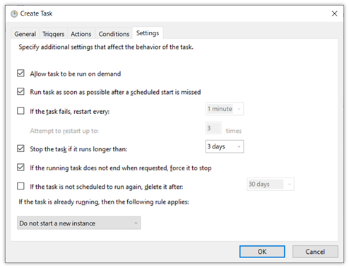
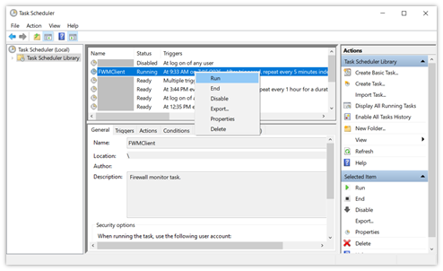

# Automating With Windows Task Scheduler

Creating a scheduled task can be troublesome, depending upon your system configuration. The basic principle, is to make sure your file and its folders, are available and can be accessed with, the permissions being used to run them by Task Scheduler.

<strong>Before Creating a Scheduled Task</strong>
 
Both Firewall Monitor apps require admin permission to run. This is satisfied in two-ways. One is selecting &quot;Run with highest privileges&quot; in Task Scheduler, the other is setting the file to run as administrator. 

Set the file to run as administrator first:
1) Navigate to your exe file for the client, right click, and select Properties.
2) Open the Compatibility tab.
 

3) Select &quot;Run this program as an administrator&quot;.
4) Click on the button for &quot;Change settings for all users&quot;.
  * This step is not always necessary - however, it is imperative that the user Task Scheduler uses, has permission to run this specific app as admin.
 

 
5) Select &quot;Run this program as an administrator&quot; in the new window.
6) Click Apply on both windows, and close them.
 
 
<strong>Creating The Scheduled Task</strong>
 
1) Open Task Scheduler, by going to:
   * Start > Windows Administrative Tools > Task Scheduler
2) Click on Task Scheduler Library on the left, to see tasks that operate at a high-level. This is where your task will be.
3) To the right, select Create Task from the Actions list.
 

 
4) Give a name you can recognize later, and a short description.
5) Very important to select:
   * Run whether user is logged on or not (assuming this is a server)
   * Run with highest privileges (required by Firewall Monitor)
 

 
6) Click on the Triggers tab, then click on New.
 

 
7) Set a schedule that fits with your circumstance. The &quot;Repeat task every&quot; option, sets the maximum amount of time between runs. If the app is set to monitor the firewall and take action, this happens at intervals corresponding to &quot;Repeat task every&quot;. Nothing happens if the app does not run, or in the space between. The same is true for expiries. Nothing expires until next run.
8) Click &quot;OK&quot;, and select the Actions tab.
9) Click New.
 

 
10) Click browse, and select the FWM_Client_02.exe (or whatever you named it).
11) Set the &quot;Start in (optional)&quot; to the path. It should match everything but the file itself. This makes a difference sometimes.
12) Click OK, set the Conditions tab how you choose, then select the Settings tab.
 

 
13) Select &quot;Run task as soon as possible after a scheduled start is missed&quot;.
14) Configure the remaining settings as you please.
15) Click OK, and review your task in the Task Scheduler Library. You can refresh the view if you like, by right-clicking on Task Scheduler Library and selecting Refresh.
 

 
16) If you checked &quot;Allow task to be run on demand&quot;, you can run your task for the first time, by right-clicking the task, and selecting Run. This allows you to review results immediately, and confirm file accessibility.
 
 
