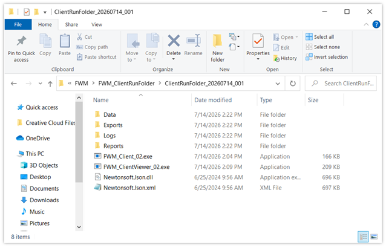
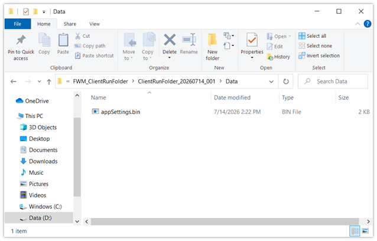
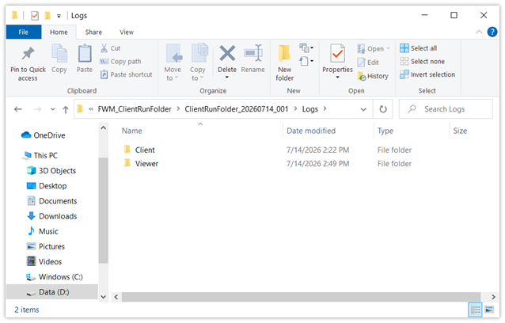
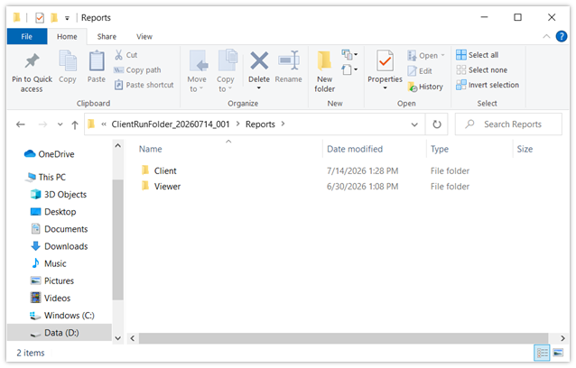

# Firewall Monitor - Client Run Folder - 2026-07-16

The Client Run Folder in Firewall Monitor, is an optional, and also the simplest, method of setting-up to run after building the monitor from sources. For all intents and purposes, because the executables sit along-side data folders when done, this can be thought of as also being the Base Directory. 

1) Build sources for the Client and the Client Viewer apps.
    * Either publish to a folder, or use files from the bin/Debug directory.
2) Create a new folder where you wish to work.
    * Copy both executables into it.
    * Copy any .dll files and their associated files into it. At present, these consist of Newtonsoft.Json.dll and   Newtonsoft.Json.Xml. Note: both apps use the same library files, you only need one-copy of each.
3) Create the following directories for data, logs, reports, and exports (exports is currently optional). These folders sit next to the exes.
    * Data
    * Exports
    * Logs
      * Client
      * Viewer
    * Reports
      * Client
      * Viewer
4) Run the viewer app (as admin). This will create a file of default settings in the Data folder.
5) The Client Run Folder is ready.
 
Tip: For build testing, it is convenient to create these folders in /bin/Debug of the projects. Depending, you may also find it convient to keep a copy of the other exe in each project's debug folder.
 
 
When complete, your Client Run Folder should look like this:
 
 

 
 
Data Folder
 

 
Note, my Data folder has an appSettings.bin file in it. If you do not have one, run the Viewer app to create default or custom settings. Only the viewer can create settings, and they must exist before the Client (console) can run properly.
 
 
Exports Folder (optional, empty, and not-shown)
 
 
Logs Folder
 

 
 
Reports Folder
 

 
 
 
